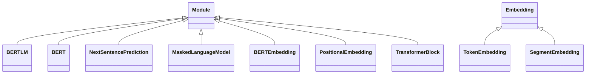

# BERT源码设计、实现、训练以及测试分析

## 1、背景

用于快速熟悉BERT模型代码设计与实现，数据构造，模型训练，模型测试，便于后续设计新的模型。

## 2、软件设计分析

### 2.1 BERT源码逻辑视图

按照代码结构可划分为BERT数据处理模块、BERT预训练处理模块、BERTLM模块；

**1、BERT数据处理模块：**包含词汇表数据处理（WordVocab对象）和BERT数据集处理（BERTDataset对象）主要功能；

**2、BERT预训练处理模块：**主要提供加载数据集，BERT训练器BERTTrainer对象利用BERTLM模块训练模型、测试模型、保存模型功能，并且提供了一个优化器处理ScheduledOptim对象实现血滤自动更新，梯度清零功能；

**3、BERTLM模块：**包含BERT模块、下一句预测模块以及MASK语言模块；

- **BERT模块（BERT）：**
  - BERT嵌入层（BERTEmbedding），由词嵌入（TokenEmbedding）、位置嵌入（PositionalEmbedding）、段嵌入（SegmentEmbedding）三部分嵌入向量相加；
  - N个Transformer模块（TransformerBlock），每个Transformer模块包含一个多头注意力模块（MultiHeadedAttention），2个残差连接模块（SublayerConnection）和1个全连接层模块（PositionwiseFeedForward）；内部结构按照多头注意力模块连接到第1个残差连接模块，经过全连接层模块，再连接到第2个残差连接模块；

  - **下一句预测模块（NextSentencePrediction）：**二分类模型，预测给定句子是否为当前句子的下一句；
  - **MASK语言模块（MaskedLanguageModel）：**N分类模型，预测词汇表中是MASK词汇的概率；

总体逻辑视图如下图所示：


### 2.2 BERT源码流程图

源码流程如下图所示，主要包含：

1、参数解析，使用argparse解析输入训练参数；

2、构建词汇表，实现了WordVocab构建词汇表，从输入文本中构建；

3、词汇表加载，利用2构建的词汇表WordVocab加载；

4、创建BERT数据集BERTDataset，包含训练数据集、测试数据集（可选）；

5、创建DataLoader，将BERT数据集加载到DataLoader对象；

6、创建BERT训练器BERTTrainer；

7、训练模型、测试模型、保存模型；


## 3、代码实现分析

### 3.1 BERT数据处理模块

#### 3.1.1 词汇表数据处理WordVocab

**测试执行**

样例输入：test.txt

```
This text is included to make sure Unicode is handled properly.
```

执行脚本：

```
python .\vocab.py -c .\test.txt -o ouput_test.txt > a.out
```

输出：

```
self.freqs:  Counter({'is': 2, 'This': 1, 'text': 1, 'included': 1, 'to': 1, 'make': 1, 'sure': 1, 'Unicode': 1, 'handled': 1, 'properly.': 1})
self.itos:  ['<pad>', '<unk>', '<eos>', '<sos>', '<mask>', 'is', 'This', 'Unicode', 'handled', 'included', 'make', 'properly.', 'sure', 'text', 'to']
self.stoi:  {'<pad>': 0, '<unk>': 1, '<eos>': 2, '<sos>': 3, '<mask>': 4, 'is': 5, 'This': 6, 'Unicode': 7, 'handled': 8, 'included': 9, 'make': 10, 'properly.': 11, 'sure': 12, 'text': 13, 'to': 14}
```

**类图如下图所示：**


**1、TorchVocab 源码分析**

一个用于处理文本数据的词汇表工具，主要功能包括将文本转换为数值表示、处理特殊符号、排序词频、加载预训练词向量以及扩展词汇表。以下是该类的详细解释：

**类属性**

- **freqs**: 使用 `collections.Counter` 记录每个词的频率。
- **stoi**: 将词映射到整数的字典。
- **itos**: 将整数映射到词的列表。

**初始化方法 `__init__`**

1. **参数处理**:
   - `counter`: 包含词频的计数器。
   - `max_size`: 词汇表的最大大小，若为 `None` 则不限制。
   - `min_freq`: 词的最低频率，低于此值的词不加入词汇表。
   - `specials`: 特殊符号列表，如 `<pad>` 和 `<oov>`。
   - `vectors`: 预训练词向量。
   - `unk_init`: 初始化未知词向量的函数。
   - `vectors_cache`: 缓存词向量的目录。
2. **处理特殊符号**:
   - 将 `specials` 添加到 `itos` 列表中。
   - 从 `counter` 中删除这些特殊符号，避免重复计数。
3. **排序和筛选词**:
   - 按词频降序排序，词频相同则按字母升序排序。
   - 遍历排序后的词，添加到 `itos`，直到达到 `max_size` 或词频低于 `min_freq`。
4. **创建 `stoi`**:
   - 生成 `itos` 的逆映射，即 `stoi`。
5. **加载词向量**:
   - 如果提供了 `vectors`，则调用 `load_vectors` 方法加载。

```python
def __init__(self, counter, max_size=None, min_freq=1, specials=['<pad>', '<oov>'],
                 vectors=None, unk_init=None, vectors_cache=None):
        """Create a Vocab object from a collections.Counter.
        Arguments:
            counter: collections.Counter object holding the frequencies of
                each value found in the data.
            max_size: The maximum size of the vocabulary, or None for no
                maximum. Default: None.
            min_freq: The minimum frequency needed to include a token in the
                vocabulary. Values less than 1 will be set to 1. Default: 1.
            specials: The list of special tokens (e.g., padding or eos) that
                will be prepended to the vocabulary in addition to an <unk>
                token. Default: ['<pad>']
            vectors: One of either the available pretrained vectors
                or custom pretrained vectors (see Vocab.load_vectors);
                or a list of aforementioned vectors
            unk_init (callback): by default, initialize out-of-vocabulary word vectors
                to zero vectors; can be any function that takes in a Tensor and
                returns a Tensor of the same size. Default: torch.Tensor.zero_
            vectors_cache: directory for cached vectors. Default: '.vector_cache'
        """
        self.freqs = counter
        counter = counter.copy()
        min_freq = max(min_freq, 1)

        self.itos = list(specials)
        for tok in specials:
            del counter[tok]

        max_size = None if max_size is None else max_size + len(self.itos)
        # sort by frequency, then alphabetically
        words_and_frequencies = sorted(counter.items(), key=lambda tup: tup[0])
        words_and_frequencies.sort(key=lambda tup: tup[1], reverse=True)
        for word, freq in words_and_frequencies:
            if freq < min_freq or len(self.itos) == max_size:
                print("if freq < min_freq or len(self.itos) == max_size:")
                break
            self.itos.append(word)
        # stoi is simply a reverse dict for itos
        self.stoi = {tok: i for i, tok in enumerate(self.itos)}
        self.vectors = None
        if vectors is not None:
            self.load_vectors(vectors, unk_init=unk_init, cache=vectors_cache)
        else:
            assert unk_init is None and vectors_cache is None
```

其他方法

- **`__eq__`**: 比较两个 `Vocab` 对象是否相等。
- **`__len__`**: 返回词汇表大小。
- **`vocab_rerank`**: 重新生成 `stoi`，通常在 `itos` 顺序改变后调用。
- **`extend`**: 扩展词汇表，可按排序或不排序方式添加另一个词汇表的词

```python
def __eq__(self, other):
        if self.freqs != other.freqs:
            return False
        if self.stoi != other.stoi:
            return False
        if self.itos != other.itos:
            return False
        if self.vectors != other.vectors:
            return False
        return True

    def __len__(self):
        return len(self.itos)

    def vocab_rerank(self):
        self.stoi = {word: i for i, word in enumerate(self.itos)}

    def extend(self, v, sort=False):
        words = sorted(v.itos) if sort else v.itos
        for w in words:
            if w not in self.stoi:
                self.itos.append(w)
                self.stoi[w] = len(self.itos) - 1
```

**Vocab 源码分析**

主要新增了两个接口load_vocab和save_vocab

```python
@staticmethod
    def load_vocab(vocab_path: str) -> 'Vocab':
        with open(vocab_path, "rb") as f:
            return pickle.load(f)

    def save_vocab(self, vocab_path):
        with open(vocab_path, "wb") as f:
            pickle.dump(self, f)
```

**WordVocab 源码分析**

**`1. __init__`方法**: 读取文本添加到Counter

```python
def __init__(self, texts, max_size=None, min_freq=1):
        print("Building Vocab")
        counter = Counter()
        for line in tqdm.tqdm(texts):
            if isinstance(line, list):
                words = line
            else:
                words = line.replace("\n", "").replace("\t", "").split()

            for word in words:
                counter[word] += 1
        print("WordVocab counter", counter)
        super().__init__(counter, max_size=max_size, min_freq=min_freq)
```

**2. `to_seq` 方法**

- **目的**：将一个句子转换为索引序列。
- 参数：
  - `sentence`：输入的句子，可以是字符串或单词列表。
  - `seq_len`：目标序列长度，可选。
  - `with_eos`：是否添加结束符（`eos_index`），默认为 `False`。
  - `with_sos`：是否添加开始符（`sos_index`），默认为 `False`。
  - `with_len`：是否返回原始序列长度，默认为 `False`。
- 实现步骤：
  1. 如果 `sentence` 是字符串，按空格分割成单词列表。
  2. 将每个单词转换为对应的索引，使用 `self.stoi.get(word, self.unk_index)`，其中 `self.unk_index` 是未知单词的索引。
  3. 如果 `with_eos` 为 `True`，在序列末尾添加 `eos_index`。
  4. 如果 `with_sos` 为 `True`，在序列开头添加 `sos_index`。
  5. 记录原始序列长度 `origin_seq_len`。
  6. 根据`seq_len`调整序列长度：
     - 如果 `seq_len` 为 `None`，不做调整。
     - 如果当前序列长度小于 `seq_len`，用 `pad_index` 填充到 `seq_len`。
     - 如果当前序列长度大于 `seq_len`，截断到 `seq_len`。
  7. 如果 `with_len` 为 `True`，返回序列和原始长度；否则，只返回序列。

```python
def to_seq(self, sentence, seq_len=None, with_eos=False, with_sos=False, with_len=False):
        if isinstance(sentence, str):
            sentence = sentence.split()

        seq = [self.stoi.get(word, self.unk_index) for word in sentence]

        if with_eos:
            seq += [self.eos_index]  # this would be index 1
        if with_sos:
            seq = [self.sos_index] + seq

        origin_seq_len = len(seq)

        if seq_len is None:
            pass
        elif len(seq) <= seq_len:
            seq += [self.pad_index for _ in range(seq_len - len(seq))]
        else:
            seq = seq[:seq_len]

        return (seq, origin_seq_len) if with_len else seq
```


3. `from_seq` 方法

- **目的**：将索引序列转换回句子。
- 参数：
  - `seq`：输入的索引序列。
  - `join`：是否将单词列表连接成字符串，默认为 `False`。
  - `with_pad`：是否保留填充符（`pad_index`），默认为 `False`。
- 实现步骤：
  1. 遍历索引序列`seq`，将每个索引转换为对应的单词：
     - 如果索引小于 `self.itos` 的长度，使用 `self.itos[idx]`。
     - 如果索引超出范围，使用 `"<%d>" % idx` 表示未知索引。
     - 如果 `with_pad` 为 `False`，过滤掉 `pad_index` 对应的索引。
  2. 如果 `join` 为 `True`，将单词列表用空格连接成字符串；否则，返回单词列表。

```python
def from_seq(self, seq, join=False, with_pad=False):
        words = [self.itos[idx]
                 if idx < len(self.itos)
                 else "<%d>" % idx
                 for idx in seq
                 if not with_pad or idx != self.pad_index]

        return " ".join(words) if join else words
```

4. `load_vocab` 静态方法

- **目的**：从文件中加载已经保存的 `WordVocab` 对象。
- 参数：
  - `vocab_path`：保存词汇表的文件路径。
- 实现步骤：
  1. 使用 `pickle` 库打开并读取文件。
  2. 返回反序列化后的 `WordVocab` 对象。

```python
@staticmethod
    def load_vocab(vocab_path: str) -> 'WordVocab':
        with open(vocab_path, "rb") as f:
            return pickle.load(f)
```


5. 关键属性和方法

- **`self.stoi`**：单词到索引的映射字典。
- **`self.itos`**：索引到单词的映射列表。
- **`self.pad_index`**：填充符的索引，通常为0。
- **`self.unk_index`**：未知单词的索引，通常为1。
- **`self.sos_index`**：开始符的索引，通常为2。
- **`self.eos_index`**：结束符的索引，通常为3。

#### 3.1.2 BERT数据集处理BERTDataset

类图设计：


测试用例：

输入：数据集、词汇表

数据集构造：

```
This text is included to	make sure Unicode is handled properly.
Text should be one-sentence-per-line	with empty lines between documents.
```

词汇表构造参考3.1.1。

测试脚本：

```python
import argparse

from dataset import BERTDataset
from vocab import WordVocab

def test():
    parser = argparse.ArgumentParser()
    parser.add_argument("-c", "--corpus_path", required=True, type=str)
    parser.add_argument("-d", "--dataset", required=True, type=str, help="train dataset for train bert")
    args = parser.parse_args()
    with open(args.corpus_path, "r", encoding="utf-8") as f:
        print(f)
        vocab = WordVocab(f)
    print("vocab: ", vocab)
    dataset = BERTDataset(args.dataset, vocab, seq_len=20)
    print("__len__: ", len(dataset))
    print("__getitem__: ", dataset[0])

test()
```

输出：

```python
self.vocab:  <vocab.WordVocab object at 0x00000237C4FF7E90>
self.seq_len:  20
self.on_memory:  True
self.corpus_lines:  2
self.corpus_path:  .\dataset.txt
self.encoding:  utf-8
self.lines:  [['This text is included to', 'make sure Unicode is handled properly.'], ['Text should be one-sentence-per-line', 'with empty lines between documents']]
__len__:  2
__getitem__:  {'bert_input': tensor([  3,  29,  68,  20, 261,   9,   2, 290, 413, 117,  20, 238, 344,   2,
          0,   0,   0,   0,   0,   0]), 'bert_label': tensor([0, 0, 0, 0, 0, 0, 0, 0, 0, 0, 0, 0, 0, 0, 0, 0, 0, 0, 0, 0]), 'segment_label': tensor([1, 1, 1, 1, 1, 1, 1, 2, 2, 2, 2, 2, 2, 2, 0, 0, 0, 0, 0, 0]), 'is_next': tensor(1)}
```

**`__init__` 方法**

1. **参数初始化**：
   - `corpus_path`：数据集文件的路径。
   - `vocab`：词汇表，可能是一个字典或列表，用于映射单词到索引。
   - `seq_len`：序列的长度，可能用于截断或填充序列。
   - `encoding`：文件的编码格式，默认为`"utf-8"`。
   - `corpus_lines`：数据集的总行数，如果为`None`，则在加载时自动计算。
   - `on_memory`：布尔值，决定是否将数据加载到内存中。

2. 功能：

   对输入数据集处理，输入数据集按照\t分割为上句下句；

输入文本：

```
This text is included to	make sure Unicode is handled properly.
Text should be one-sentence-per-line	with empty lines between documents.
```

处理结果：

```
self.lines:  [['This text is included to', 'make sure Unicode is handled properly.'], ['Text should be one-sentence-per-line', 'with empty lines between documents']]
self.corpus_lines:  2
```

**`__getitem__`方法**

1. **获取随机句子对**（NSP）：

   - 调用`self.random_sent(item)`方法，传入当前索引`item`，返回两个句子`t1`和`t2`，以及一个标签`is_next_label`，表示这两个句子是否是连续的。

   ```python
       def random_sent(self, index):
           t1, t2 = self.get_corpus_line(index)
           if random.random() > 0.5:
               res = t1, t2, 1
           else:
               res = t1, self.get_random_line(), 0
           return res
       
           def get_corpus_line(self, item):
           if self.on_memory:
               return self.lines[item][0], self.lines[item][1]
           else:
               line = self.file.__next__()
               if line is None:
                   self.file.close()
                   self.file = open(self.corpus_path, "r", encoding=self.encoding)
                   line = self.file.__next__()
   
               t1, t2 = line[:-1].split("\t")
               return t1, t2
   ```

2. **随机替换单词**（MLM）：

   - 对句子`t1`调用`self.random_word(t1)`，返回随机替换后的句子`t1_random`和对应的替换标签`t1_label`。
   - 对句子`t2`调用`self.random_word(t2)`，返回随机替换后的句子`t2_random`和对应的替换标签`t2_label`。

   测试:

   ```
   sentence:  This text is included to
   seq:  [29, 68, 20, 261, 9]
   res:  ['This', 'text', 'is', 'included', 'to']
   seq:  [0, 0, 0, 0, 0]
   res:  ['<pad>', '<pad>', '<pad>', '<pad>', '<pad>']
   tokens, output_label:  ['This', 'text', 'is', 'included', 'to'] ['<pad>', '<pad>', '<pad>', '<pad>', '<pad>']
   sentence:  make sure Unicode is handled properly.
   seq:  [4, 4, 117, 20, 238, 4]
   res:  ['<mask>', '<mask>', 'Unicode', 'is', 'handled', '<mask>']
   seq:  [290, 413, 0, 0, 0, 344]
   res:  ['make', 'sure', '<pad>', '<pad>', '<pad>', 'properly.']
   tokens, output_label:  ['<mask>', '<mask>', 'Unicode', 'is', 'handled', '<mask>'] ['make', 'sure', '<pad>', '<pad>', '<pad>', 'properly.']
   ```

   源码：

   ```python
       def random_word(self, sentence):
           tokens = sentence.split()
           output_label = []
           
           for i, token in enumerate(tokens):
               prob = random.random()
               if prob < 0.15:
                   prob /= 0.15
   
                   # 80% randomly change token to mask token
                   if prob < 0.8:
                       tokens[i] = self.vocab.mask_index
   
                   # 10% randomly change token to random token
                   elif prob < 0.9:
                       tokens[i] = random.randrange(len(self.vocab))
   
                   # 10% randomly change token to current token
                   else:
                       tokens[i] = self.vocab.stoi.get(token, self.vocab.unk_index)
                   output_label.append(self.vocab.stoi.get(token, self.vocab.unk_index))
   
               else:
                   tokens[i] = self.vocab.stoi.get(token, self.vocab.unk_index)
                   output_label.append(0)
         
           return tokens, output_label
   ```

   

3. **添加起始和结束标记**：

   - 在`t1_random`的开头添加起始标记`self.vocab.sos_index`，在结尾添加结束标记`self.vocab.eos_index`，形成新的`t1`。
   - 在`t2_random`的开头添加起始标记`self.vocab.sos_index`，在结尾添加结束标记`self.vocab.eos_index`，形成新的`t2`。

4. **处理替换标签**：

   - 在`t1_label`的开头和结尾添加填充标记`self.vocab.pad_index`，形成新的`t1_label`。
   - 在`t2_label`的开头和结尾添加填充标记`self.vocab.pad_index`，形成新的`t2_label`。

5. **生成分段标签**：

   - 创建一个长度为`self.seq_len`的`segment_label`列表，前半部分用1填充，后半部分用2填充，表示两个句子的分段信息。

6. **拼接输入和标签**：

   - 将`t1`和`t2`拼接，形成`bert_input`，并截断到`self.seq_len`的长度。
   - 将`t1_label`和`t2_label`拼接，形成`bert_label`，并截断到`self.seq_len`的长度。

7. **填充到固定长度**：

   - 计算需要填充的长度`padding_length = self.seq_len - len(bert_input)`。
   - 创建一个填充列表`padding`，长度为`padding_length`，填充值为`self.vocab.pad_index`。
   - 将`padding`添加到`bert_input`, `bert_label`, 和`segment_label`的末尾，确保它们的长度都为`self.seq_len`。

8. **构建输出字典**：

   - 将`bert_input`, `bert_label`, `segment_label`, 和`is_next_label`组合成一个字典`output`。
   - 将字典中的每个值转换为PyTorch的张量（tensor），并返回。

打印过程：

```
self.lines:  [['This text is included to', 'make sure Unicode is handled properly.'], ['Text should be one-sentence-per-line', 'with empty lines between documents']]
__len__:  2
t1, t2, is_next_label:  This text is included to make sure Unicode is handled properly. 1
sentence:  This text is included to
seq:  [4, 97, 20, 261, 9]
res:  ['<mask>', 'Hypatia', 'is', 'included', 'to']
seq:  [29, 68, 0, 0, 0]
res:  ['This', 'text', '<pad>', '<pad>', '<pad>']
tokens, output_label:  ['<mask>', 'Hypatia', 'is', 'included', 'to'] ['This', 'text', '<pad>', '<pad>', '<pad>']
sentence:  make sure Unicode is handled properly.
seq:  [290, 4, 117, 20, 238, 344]
res:  ['make', '<mask>', 'Unicode', 'is', 'handled', 'properly.']
seq:  [0, 413, 0, 0, 0, 0]
res:  ['<pad>', 'sure', '<pad>', '<pad>', '<pad>', '<pad>']
tokens, output_label:  ['make', '<mask>', 'Unicode', 'is', 'handled', 'properly.'] ['<pad>', 'sure', '<pad>', '<pad>', '<pad>', '<pad>']
t1_random, t1_label:  [4, 97, 20, 261, 9] [29, 68, 0, 0, 0]
t2_random, t2_label:  [290, 4, 117, 20, 238, 344] [0, 413, 0, 0, 0, 0]
t1, t2:  [3, 4, 97, 20, 261, 9, 2] [290, 4, 117, 20, 238, 344, 2]
t1_label, t2_label:  [0, 29, 68, 0, 0, 0, 0] [0, 413, 0, 0, 0, 0, 0]
segment_label:  [1, 1, 1, 1, 1, 1, 1, 2, 2, 2, 2, 2, 2, 2]
bert_input:  [3, 4, 97, 20, 261, 9, 2, 290, 4, 117, 20, 238, 344, 2]
bert_label:  [0, 29, 68, 0, 0, 0, 0, 0, 413, 0, 0, 0, 0, 0]
padding:  [0, 0, 0, 0, 0, 0]
__getitem__:  {'bert_input': tensor([  3,   4,  97,  20, 261,   9,   2, 290,   4, 117,  20, 238, 344,   2,
          0,   0,   0,   0,   0,   0]), 'bert_label': tensor([  0,  29,  68,   0,   0,   0,   0,   0, 413,   0,   0,   0,   0,   0,
          0,   0,   0,   0,   0,   0]), 'segment_label': tensor([1, 1, 1, 1, 1, 1, 1, 2, 2, 2, 2, 2, 2, 2, 0, 0, 0, 0, 0, 0]), 'is_next': tensor(1)}
```

源码：

```python
    def __getitem__(self, item):
        t1, t2, is_next_label = self.random_sent(item)

        print("t1, t2, is_next_label: ", t1, t2, is_next_label)
        t1_random, t1_label = self.random_word(t1)
        t2_random, t2_label = self.random_word(t2)
        print("t1_random, t1_label: ", t1_random, t1_label)
        print("t2_random, t2_label: ", t2_random, t2_label)
        # [CLS] tag = SOS tag, [SEP] tag = EOS tag
        t1 = [self.vocab.sos_index] + t1_random + [self.vocab.eos_index]
        t2 = t2_random + [self.vocab.eos_index]
        print("t1, t2: ", t1, t2)
        
        t1_label = [self.vocab.pad_index] + t1_label + [self.vocab.pad_index]
        t2_label = t2_label + [self.vocab.pad_index]
        print("t1_label, t2_label: ", t1_label, t2_label)

        segment_label = ([1 for _ in range(len(t1))] + [2 for _ in range(len(t2))])[:self.seq_len]
        bert_input = (t1 + t2)[:self.seq_len]
        bert_label = (t1_label + t2_label)[:self.seq_len]
        print("segment_label: ", segment_label)
        print("bert_input: ", bert_input)
        print("bert_label: ", bert_label)

        padding = [self.vocab.pad_index for _ in range(self.seq_len - len(bert_input))]
        bert_input.extend(padding), bert_label.extend(padding), segment_label.extend(padding)
        print("padding: ", padding)

        output = {"bert_input": bert_input,
                  "bert_label": bert_label,
                  "segment_label": segment_label,
                  "is_next": is_next_label}

        return {key: torch.tensor(value) for key, value in output.items()}
```

##### `DataLoader` 介绍

`DataLoader` 是 PyTorch 中用于加载数据的重要工具，它简化了数据加载和预处理的过程，特别适用于深度学习任务。以下是使用 `DataLoader` 的详细步骤：

**1. 安装 PyTorch**

首先，确保你已经安装了 PyTorch。如果没有安装，可以通过以下命令进行安装：

```bash
pip install torch torchvision
```

**2. 导入必要的库**

在你的 Python 脚本中导入 `DataLoader` 和其他必要的库：

```python
import torch
from torch.utils.data import DataLoader, Dataset
```

**3. 创建自定义数据集类**

`DataLoader` 需要一个继承自 `Dataset` 的类来定义你的数据集。你需要实现 `__len__` 和 `__getitem__` 方法。

```python
class MyDataset(Dataset):
    def __init__(self, data, labels):
        self.data = data
        self.labels = labels

    def __len__(self):
        return len(self.data)

    def __getitem__(self, idx):
        sample = self.data[idx]
        label = self.labels[idx]
        return sample, label
```

**4. 初始化数据集实例**

创建一个 `MyDataset` 实例，传入你的数据和标签。

```python
# 假设你有数据和标签
data = [...]  # 你的数据
labels = [...]  # 你的标签

dataset = MyDataset(data, labels)
```

**5. 创建 DataLoader 实例**

使用 `DataLoader` 包装你的数据集，并设置所需的参数。

```python
batch_size = 32
shuffle = True  # 是否打乱数据
num_workers = 4  # 使用4个子进程加载数据

data_loader = DataLoader(dataset, 
                         batch_size=batch_size,
                         shuffle=shuffle,
                         num_workers=num_workers)
```


**6. 遍历 DataLoader 加载数据**

在训练循环中，使用 `for` 循环遍历 `DataLoader`，每次获取一批数据。

```python
for epoch in range(num_epochs):
    for batch_data, batch_labels in data_loader:
        # 将数据传输到GPU（如果使用GPU）
        batch_data = batch_data.to(device)
        batch_labels = batch_labels.to(device)
        
        # 前向传播
        outputs = model(batch_data)
        
        # 计算损失
        loss = criterion(outputs, batch_labels)
        
        # 反向传播和优化
        optimizer.zero_grad()
        loss.backward()
        optimizer.step()
```

**7. 使用多线程加载数据**

通过设置 `num_workers` 参数，可以启用多线程加载数据，加快数据加载速度。

```python
data_loader = DataLoader(dataset, 
                         batch_size=batch_size,
                         shuffle=shuffle,
                         num_workers=4)
```

**8. 启用内存优化**

通过设置 `pin_memory` 参数为 `True`，可以将数据加载到内存中，加快数据传输到 GPU 的速度。

```python
data_loader = DataLoader(dataset, 
                         batch_size=batch_size,
                         shuffle=shuffle,
                         num_workers=4,
                         pin_memory=True)
```

**9. 处理不同的数据集**

对于训练集和验证集，可以分别创建不同的 `DataLoader` 实例，并设置不同的参数。

```python
# 训练集DataLoader
train_loader = DataLoader(train_dataset, 
                         batch_size=batch_size,
                         shuffle=True,
                         num_workers=4)

# 验证集DataLoader
val_loader = DataLoader(val_dataset, 
                       batch_size=batch_size,
                       shuffle=False,
                       num_workers=4)
```

**10. 集成数据预处理和增强**

在 `__getitem__` 方法中，可以添加数据预处理和增强的逻辑。

```python
class MyDataset(Dataset):
    def __init__(self, data, labels, transform=None):
        self.data = data
        self.labels = labels
        self.transform = transform

    def __len__(self):
        return len(self.data)

    def __getitem__(self, idx):
        sample = self.data[idx]
        label = self.labels[idx]
        
        if self.transform:
            sample = self.transform(sample)
            
        return sample, label
```

然后在创建数据集时传入预处理变换：

```python
from torchvision import transforms

transform = transforms.Compose([
    transforms.Resize(256),
    transforms.RandomCrop(224),
    transforms.ToTensor(),
    transforms.Normalize(mean=[0.485, 0.456, 0.406],
                         std=[0.229, 0.224, 0.225])
])

dataset = MyDataset(data, labels, transform=transform)
```

**11. 处理分布式训练**

在分布式训练中，可以使用 `DistributedSampler` 来确保每个进程加载不同的数据子集。

```python
from torch.utils.data.distributed import DistributedSampler

sampler = DistributedSampler(dataset)
data_loader = DataLoader(dataset, 
                         batch_size=batch_size,
                         shuffle=False,
                         num_workers=4,
                         sampler=sampler)
```

**12. 使用 `collate_fn` 自定义批量处理**

如果需要对每个批量的数据进行自定义处理，可以使用 `collate_fn` 参数。

```python
def my_collate(batch):
    # 自定义批量处理逻辑
    data = [item[0] for item in batch]
    labels = [item[1] for item in batch]
    return data, labels

data_loader = DataLoader(dataset, 
                         batch_size=batch_size,
                         shuffle=shuffle,
                         num_workers=4,
                         collate_fn=my_collate)
```

**13. 使用 `prefetch` 加速数据加载**

PyTorch 提供了 `prefetch` 功能，可以在数据加载过程中预取下一批数据，进一步提高数据加载速度。

```python
from torch.utils.data import DataLoader, Dataset
from torch.utils.data._utils import prefetch

data_loader = DataLoader(dataset, 
                         batch_size=batch_size,
                         shuffle=shuffle,
                         num_workers=4,
                         prefetch_factor=2)
```

**14. 监控数据加载速度**

在训练过程中，可以使用 `tqdm` 库来监控数据加载和训练的进度。

```python
from tqdm import tqdm

for epoch in range(num_epochs):
    for batch_data, batch_labels in tqdm(data_loader, desc=f"Epoch {epoch+1}/{num_epochs}"):
        # 执行训练操作
        ...
```


### 3.2 BERTLM模块BERTLM

BERTLM模块主要包含BERT模型以及预训练任务NextSentencePrediction模块和MaskedLanguageModel模块；

类图设计：





#### 3.2.1 BERT模块BERT

 BERT模块主要包含BERTEmbedding模块，TransformerBlock模块；

类图设计：


##### 3.2.1.1 BERT嵌入层BERTEmbedding

BERTEmbedding模块主要包含TokenEmbedding词嵌入、PositionalEmbedding位置嵌入、SegmentEmbedding段嵌入模块；

- `nn.Embedding`是PyTorch中用于词嵌入的模块，能够将离散的词索引映射为连续的向量表示。
- 主要参数包括：
  - `num_embeddings`：词汇表大小，即不同词索引的总数。
  - `embedding_dim`：嵌入向量的维度。
  - `padding_idx`：指定一个索引，其对应的嵌入向量将保持为零，常用于处理填充（padding）。


**测试执行**

样例输入：

```python

import torch
from embedding.bert import BERTEmbedding


def test():
    embedding = BERTEmbedding(455, 256)
    data = {
        'bert_input': torch.tensor([[  3,   4,  97,  20, 261,   9,   2, 290,   4, 117,  20, 238, 344,   2,  0,   0,   0,   0,   0,   0]]), 
        'bert_label': torch.tensor([  0,  29,  68,   0,   0,   0,   0,   0, 413,   0,   0,   0,   0,   0,  0,   0,   0,   0,   0,   0]),
        'segment_label': torch.tensor([1, 1, 1, 1, 1, 1, 1, 2, 2, 2, 2, 2, 2, 2, 0, 0, 0, 0, 0, 0]), 
        'is_next': torch.tensor(1)
    }

    res = embedding.forward(data["bert_input"], data["segment_label"])
    print("res: ", res.shape, res)

test()
```

执行脚本：

```python
python .\test.py >embedding.out 2>&1
```

输出：

```python
BERTEmbedding vocab_size embed_size: 455 256
PositionalEmbedding d_model, max_len:  256 512
PositionalEmbedding position torch.Size([512, 1]) tensor([[0.],
        [1.],
        [2.]])
PositionalEmbedding div_term torch.Size([128]) tensor([1.0000, 0.9306, 0.8660])
PositionalEmbedding self.pe torch.Size([1, 512, 256]) tensor([[[ 0.0000e+00,  1.0000e+00,  0.0000e+00,  ...,  1.0000e+00,
           0.0000e+00,  1.0000e+00],
         [ 8.4147e-01,  5.4030e-01,  8.0196e-01,  ...,  1.0000e+00,
           1.0746e-04,  1.0000e+00],
         [ 9.0930e-01, -4.1615e-01,  9.5814e-01,  ...,  1.0000e+00,
           2.1492e-04,  1.0000e+00],
         ...,
         [ 6.1950e-02,  9.9808e-01,  6.5888e-01,  ...,  9.9827e-01,
           5.4670e-02,  9.9850e-01],
         [ 8.7333e-01,  4.8714e-01, -2.0968e-01,  ...,  9.9827e-01,
           5.4778e-02,  9.9850e-01],
         [ 8.8177e-01, -4.7168e-01, -9.0939e-01,  ...,  9.9826e-01,
           5.4885e-02,  9.9849e-01]]])
BERTEmbedding sequence:  torch.Size([1, 20]) tensor([[  3,   4,  97,  20, 261,   9,   2, 290,   4, 117,  20, 238, 344,   2,
           0,   0,   0,   0,   0,   0]])
BERTEmbedding segment_label:  torch.Size([20]) tensor([1, 1, 1, 1, 1, 1, 1, 2, 2, 2, 2, 2, 2, 2, 0, 0, 0, 0, 0, 0])
BERTEmbedding token:  torch.Size([1, 20, 256]) tensor([[[-1.1859e-03, -3.0431e-01, -1.4573e-01,  ...,  5.1628e-01,
           4.8443e-01, -3.3427e-01],
         [-1.9146e+00,  7.3151e-01, -7.6136e-02,  ...,  1.5678e+00,
          -4.1741e-01, -9.2169e-01],
         [-3.0334e-01,  6.0196e-01, -3.1732e+00,  ..., -2.9936e-01,
           5.4947e-01, -8.7638e-01],
         ...,
         [ 0.0000e+00,  0.0000e+00,  0.0000e+00,  ...,  0.0000e+00,
           0.0000e+00,  0.0000e+00],
         [ 0.0000e+00,  0.0000e+00,  0.0000e+00,  ...,  0.0000e+00,
           0.0000e+00,  0.0000e+00],
         [ 0.0000e+00,  0.0000e+00,  0.0000e+00,  ...,  0.0000e+00,
           0.0000e+00,  0.0000e+00]]], grad_fn=<EmbeddingBackward0>)
BERTEmbedding: position torch.Size([1, 20, 256]) tensor([[[ 0.0000e+00,  1.0000e+00,  0.0000e+00,  ...,  1.0000e+00,
           0.0000e+00,  1.0000e+00],
         [ 8.4147e-01,  5.4030e-01,  8.0196e-01,  ...,  1.0000e+00,
           1.0746e-04,  1.0000e+00],
         [ 9.0930e-01, -4.1615e-01,  9.5814e-01,  ...,  1.0000e+00,
           2.1492e-04,  1.0000e+00],
         ...,
         [-9.6140e-01, -2.7516e-01, -1.1153e-01,  ...,  1.0000e+00,
           1.8268e-03,  1.0000e+00],
         [-7.5099e-01,  6.6032e-01, -8.6358e-01,  ...,  1.0000e+00,
           1.9343e-03,  1.0000e+00],
         [ 1.4988e-01,  9.8870e-01, -9.2024e-01,  ...,  1.0000e+00,
           2.0418e-03,  1.0000e+00]]])
BERTEmbedding: segment torch.Size([20, 256]) tensor([[-0.3239,  0.1975,  0.9369,  ..., -0.7468,  1.8233, -0.5944],
        [-0.3239,  0.1975,  0.9369,  ..., -0.7468,  1.8233, -0.5944],
        [-0.3239,  0.1975,  0.9369,  ..., -0.7468,  1.8233, -0.5944],
        ...,
        [ 0.0000,  0.0000,  0.0000,  ...,  0.0000,  0.0000,  0.0000],
        [ 0.0000,  0.0000,  0.0000,  ...,  0.0000,  0.0000,  0.0000],
        [ 0.0000,  0.0000,  0.0000,  ...,  0.0000,  0.0000,  0.0000]],
       grad_fn=<EmbeddingBackward0>)
res:  torch.Size([1, 20, 256]) tensor([[[-3.6125e-01,  9.9249e-01,  0.0000e+00,  ...,  8.5501e-01,
           2.5642e+00,  7.9291e-02],
         [-1.5523e+00,  1.6326e+00,  1.8475e+00,  ...,  2.0234e+00,
           1.5623e+00, -5.7339e-01],
         [ 3.1335e-01,  4.2595e-01, -1.4201e+00,  ..., -5.1252e-02,
           0.0000e+00, -5.2305e-01],
         ...,
         [-1.0682e+00, -3.0574e-01, -0.0000e+00,  ...,  1.1111e+00,
           2.0298e-03,  1.1111e+00],
         [-8.3443e-01,  7.3369e-01, -9.5954e-01,  ...,  1.1111e+00,
           0.0000e+00,  1.1111e+00],
         [ 1.6653e-01,  0.0000e+00, -1.0225e+00,  ...,  1.1111e+00,
           2.2686e-03,  1.1111e+00]]], grad_fn=<MulBackward0>)

```

**类图如下图所示：**

**1、词嵌入TokenEmbedding**

实现继承nn.Embedding，给定vocab_size和embed_size参数；

- `nn.Embedding`是PyTorch中用于词嵌入的模块，能够将离散的词索引映射为连续的向量表示。
- 主要参数包括：
  - `num_embeddings`：词汇表大小，即不同词索引的总数。
  - `embedding_dim`：嵌入向量的维度。
  - `padding_idx`：指定一个索引，其对应的嵌入向量将保持为零，常用于处理填充（padding）。

**源码：**

```python
class TokenEmbedding(nn.Embedding):
    def __init__(self, vocab_size, embed_size=512):
        super().__init__(vocab_size, embed_size, padding_idx=0)
```


###### **nn.Embedding 介绍**

`nn.Embedding` 是 PyTorch 中的一个常用模块，用于将离散的词或元素映射到连续的向量表示。它在自然语言处理（NLP）任务中尤为常见，例如将单词转换为词嵌入（word embeddings）。

**主要功能**

1. **输入处理**：接受整数索引作为输入，这些索引代表不同的词或元素。
2. **输出**：返回对应的嵌入向量，形状为 `(batch_size, sequence_length, embedding_dim)`。

**初始化参数**

- `num_embeddings`：词汇表大小，即不同索引的总数。
- `embedding_dim`：嵌入向量的维度。
- `padding_idx`（可选）：指定一个索引，其对应的嵌入向量将保持为零，常用于处理填充（padding）。
- `max_norm`（可选）：嵌入向量的最大范数，用于归一化。
- `norm_type`（可选）：归一化的类型，默认为 2 范数。
- `scale_grad_by_freq`（可选）：是否按词频缩放梯度。
- `sparse`（可选）：是否使用稀疏梯度，通常用于节省内存。

**示例**

```python
import torch
import torch.nn as nn

# 初始化一个Embedding层，词汇表大小为10，嵌入维度为5
embedding = nn.Embedding(num_embeddings=10, embedding_dim=5)

# 输入是一个形状为(3, 4)的张量，表示3个样本，每个样本有4个词
input = torch.LongTensor([[1, 2, 3, 4], [5, 6, 7, 8], [9, 0, 1, 2]])

# 前向传播，输出形状为(3, 4, 5)
output = embedding(input)
print(output.size())  # 输出: torch.Size([3, 4, 5])
```

**应用场景**

- **词嵌入**：将单词索引映射为密集向量。
- **序列模型**：如 RNN、LSTM、Transformer 等，作为输入层。
- **填充处理**：通过 `padding_idx` 处理序列中的填充位置。

**注意事项**

- 输入必须是整数索引，且在 `[0, num_embeddings-1]` 范围内。
- 如果启用了 `sparse=True`，梯度计算会更高效，但可能不支持所有优化器。

`nn.Embedding` 是构建深度学习模型，尤其是 NLP 模型时的重要组件。


**2、位置嵌入PositionalEmbedding**

源码：

```python
class PositionalEmbedding(nn.Module):

    def __init__(self, d_model, max_len=512):
        print("PositionalEmbedding d_model, max_len: ", d_model, max_len)
        super().__init__()

        # Compute the positional encodings once in log space.
        pe = torch.zeros(max_len, d_model).float()
        pe.require_grad = False

        position = torch.arange(0, max_len).float().unsqueeze(1)
        div_term = (torch.arange(0, d_model, 2).float() * -(math.log(10000.0) / d_model)).exp()

        pe[:, 0::2] = torch.sin(position * div_term)
        pe[:, 1::2] = torch.cos(position * div_term)

        pe = pe.unsqueeze(0)

        self.register_buffer('pe', pe)

        print("PositionalEmbedding self.pe", self.pe.shape, self.pe)

    def forward(self, x):
        return self.pe[:, :x.size(1)]
```


**步骤详解**

1. **理解类的继承和初始化**：
   - `PositionalEmbedding`继承自`nn.Module`，这意味着它是一个自定义的神经网络模块。
   - 在`__init__`方法中，接受两个参数：`d_model`（嵌入向量的维度）和`max_len`（序列的最大长度）。
2. **初始化位置嵌入张量`pe`**：
   - 创建一个形状为`(max_len, d_model)`的零张量`pe`，数据类型为`float`。
   - 设置`pe.require_grad = False`，表示在反向传播时，`pe`的梯度不会被更新。
3. **计算位置和频率相关的项**：
   - `position`是一个从0到`max_len-1`的序列，形状为`(max_len, 1)`。
   - `div_term`是通过以下步骤计算的：
     - 生成一个从0开始，步长为2的序列，直到`d_model`。
     - 将这个序列乘以`-(math.log(10000.0) / d_model)`，然后取指数。
     - 这一步生成了一个频率递减的序列，用于控制正弦和余弦函数的频率。
4. **填充位置嵌入张量`pe`**：
   - 使用正弦函数填充`pe`的偶数索引位置（`0::2`）。
   - 使用余弦函数填充`pe`的奇数索引位置（`1::2`）。
   - 这样，每个位置的嵌入向量由正弦和余弦函数的组合构成，编码了位置信息。
5. **调整`pe`的形状并注册为缓冲区**：
   - 通过`unsqueeze(0)`，`pe`的形状变为`(1, max_len, d_model)`，增加了一个batch维度。
   - 使用`self.register_buffer('pe', pe)`将`pe`注册为一个持久化的缓冲区。这意味着`pe`会被保存在模型的`state_dict`中，但在反向传播时不会被更新。
6. **定义前向传播方法`forward`**：
   - 输入`x`的形状为`(batch_size, seq_len, d_model)`。
   - 通过`self.pe[:, :x.size(1)]`，截取`pe`的前`seq_len`个位置嵌入向量，形状变为`(1, seq_len, d_model)`。
   - 返回截取后的`pe`张量，供后续的模型层使用。
7. **广播机制的应用**：
   - 在实际使用中，`self.pe`的形状`(1, seq_len, d_model)`可以与输入`x`的形状`(batch_size, seq_len, d_model)`进行广播。
   - 这使得每个样本都能加上对应的位置嵌入向量，从而为模型提供位置信息。
8. **注意事项**：
   - 确保输入序列的长度不超过`max_len`，否则在`forward`方法中会尝试截取超过`max_len`的部分，导致错误。
   - 如果需要位置嵌入可学习，可以将`pe.require_grad`设置为`True`，并在优化器中包含这些参数。


**3、段嵌入SegmentEmbedding**

实现继承nn.Embedding，给定vocab_size和embed_size参数；

源码：

```python
class SegmentEmbedding(nn.Embedding):
    def __init__(self, embed_size=512):
        super().__init__(3, embed_size, padding_idx=0)
```

##### 3.2.1.2 Transformer 模块TransformerBlock

类图设计：


源码：

```python
class TransformerBlock(nn.Module):
    """
    Bidirectional Encoder = Transformer (self-attention)
    Transformer = MultiHead_Attention + Feed_Forward with sublayer connection
    """

    def __init__(self, hidden, attn_heads, feed_forward_hidden, dropout):
        """
        :param hidden: hidden size of transformer
        :param attn_heads: head sizes of multi-head attention
        :param feed_forward_hidden: feed_forward_hidden, usually 4*hidden_size
        :param dropout: dropout rate
        """
        print("TransformerBlock hidden, attn_heads, feed_forward_hidden, dropout:", hidden, attn_heads, feed_forward_hidden, dropout)
        super().__init__()
        self.attention = MultiHeadedAttention(h=attn_heads, d_model=hidden)
        self.feed_forward = PositionwiseFeedForward(d_model=hidden, d_ff=feed_forward_hidden, dropout=dropout)
        self.input_sublayer = SublayerConnection(size=hidden, dropout=dropout)
        self.output_sublayer = SublayerConnection(size=hidden, dropout=dropout)
        self.dropout = nn.Dropout(p=dropout)

        print("[DEBUG] attention: ", self.attention)
        print("[DEBUG] feed_forward: ", self.feed_forward)
        print("[DEBUG] input_sublayer: ", self.input_sublayer)
        print("[DEBUG] output_sublayer: ", self.output_sublayer)
        

    def forward(self, x, mask):
        x = self.input_sublayer(x, lambda _x: self.attention.forward(_x, _x, _x, mask=mask))
        x = self.output_sublayer(x, self.feed_forward)
        return self.dropout(x)
```

**多头注意力模块MultiHeadedAttention**

源码：

```python
class MultiHeadedAttention(nn.Module):
    """
    Take in model size and number of heads.
    """

    def __init__(self, h, d_model, dropout=0.1):
        super().__init__()
        assert d_model % h == 0

        # We assume d_v always equals d_k
        self.d_k = d_model // h
        self.h = h

        self.linear_layers = nn.ModuleList([nn.Linear(d_model, d_model) for _ in range(3)])
        self.output_linear = nn.Linear(d_model, d_model)
        self.attention = Attention()

        self.dropout = nn.Dropout(p=dropout)

    
    def forward(self, query, key, value, mask=None):
        batch_size = query.size(0)

        # 1) Do all the linear projections in batch from d_model => h x d_k
        query, key, value = [l(x).view(batch_size, -1, self.h, self.d_k).transpose(1, 2)
                             for l, x in zip(self.linear_layers, (query, key, value))]

        # 2) Apply attention on all the projected vectors in batch.
        x, attn = self.attention(query, key, value, mask=mask, dropout=self.dropout)

        # 3) "Concat" using a view and apply a final linear.
        x = x.transpose(1, 2).contiguous().view(batch_size, -1, self.h * self.d_k)

        return self.output_linear(x)
```

**分步解释**

1. **初始化方法 (`__init__`)**：
   - **参数检查**：确保 `d_model` 能被 `h` 整除，以保证每个头的维度 `d_k` 是整数。
   - **维度计算**：计算每个头的维度 `d_k = d_model // h`。
   - **线性层创建**：创建三个线性层用于将输入投影到查询、键和值空间，以及一个输出线性层用于合并多头输出。
   - **注意力机制实例化**：使用 `Attention` 类来处理每个头的注意力计算。
   - **Dropout层**：用于防止过拟合。
2. **前向传播方法 (`forward`)**：
   - **批次大小获取**：获取输入的批次大小 `batch_size`。
   - **线性变换与重塑**：对查询、键和值分别应用线性层，然后重塑为 `(batch_size, h, seq_len, d_k)` 形状，以便处理多头。
   - **注意力计算**：调用 `attention` 方法，计算每个头的注意力输出和注意力权重。
   - **结果拼接与线性变换**：将多头结果拼接，通过输出线性层得到最终输出。

**代码分析**

- **线性层应用**：三个线性层分别处理查询、键和值，确保每个头的输入维度正确。
- **形状变换**：通过重塑和转置，将输入分成多个头，每个头处理各自的注意力计算。
- **注意力机制**：使用自定义的 `Attention` 类，可能包含缩放点积和softmax操作。
- **结果拼接**：将多头结果拼接回原维度，并通过线性层调整输出。


**注意力模块Attention：**

```python
class Attention(nn.Module):
    """
    Compute 'Scaled Dot Product Attention
    """

    def forward(self, query, key, value, mask=None, dropout=None):
        scores = torch.matmul(query, key.transpose(-2, -1)) \
                 / math.sqrt(query.size(-1))

        if mask is not None:
            scores = scores.masked_fill(mask == 0, -1e9)

        p_attn = F.softmax(scores, dim=-1)

        if dropout is not None:
            p_attn = dropout(p_attn)

        return torch.matmul(p_attn, value), p_attn
```

**分步解释**

1. **初始化 (`__init__` 方法)**：
   - 该类继承自 `nn.Module`，表示它是一个神经网络模块。
   - 该类没有定义任何初始化参数，所有操作都在 `forward` 方法中完成。
2. **前向传播 (`forward` 方法)**：
   - **输入参数**：
     - `query`：查询向量，形状为 `[batch_size, num_heads, seq_len, d_k]`。
     - `key`：键向量，形状为 `[batch_size, num_heads, seq_len, d_k]`。
     - `value`：值向量，形状为 `[batch_size, num_heads, seq_len, d_v]`。
     - `mask`：可选的遮盖矩阵，形状为 `[batch_size, 1, 1, seq_len]`，用于遮盖某些位置。
     - `dropout`：可选的`Dropout`层，用于防止过拟合。
   - **计算注意力得分 (`scores`)**：
     - 使用 `torch.matmul(query, key.transpose(-2, -1))` 计算查询和键的点积。`key.transpose(-2, -1)` 将键的最后两个维度交换，使得点积运算可以正确进行。
     - 点积结果的形状为 `[batch_size, num_heads, seq_len, seq_len]`。
     - 将点积结果除以 `math.sqrt(query.size(-1))`，即 `sqrt(d_k)`，进行缩放，防止点积结果过大。
   - **应用遮盖 (`mask`)**：
     - 如果提供了 `mask`，则使用 `scores.masked_fill(mask == 0, -1e9)` 将 `mask` 为0的位置对应的 `scores` 设为一个非常小的数（`-1e9`）。
     - 这样，在后续的 `softmax` 操作中，这些位置的概率会趋近于0，从而被遮盖。
   - **计算注意力权重 (`p_attn`)**：
     - 对 `scores` 在最后一维（即序列长度）应用 `F.softmax`，得到概率分布，形状为 `[batch_size, num_heads, seq_len, seq_len]`。
   - **应用 Dropout**：
     - 如果提供了 `dropout`，则对 `p_attn` 应用 `dropout`，以防止过拟合。
   - **计算输出 (`output`)**：
     - 使用 `torch.matmul(p_attn, value)` 将注意力权重与值向量相乘，得到最终的注意力输出。
     - 输出的形状为 `[batch_size, num_heads, seq_len, d_v]`。
   - **返回结果**：
     - 返回注意力输出 `output` 和注意力权重 `p_attn`。

**代码分析**

- **缩放点积注意力**：
  - 该类实现了标准的缩放点积注意力机制，通过计算查询和键的点积，缩放，应用遮盖，计算注意力权重，与值向量相乘，得到最终的注意力输出。
- **遮盖机制**：
  - 通过 `mask` 参数，可以遮盖某些位置，防止模型关注到这些位置的信息。这在处理序列数据时非常有用，例如在处理句子时，可以遮盖未来的位置，防止模型看到未来的信息。
- **Dropout**：
  - 在计算注意力权重后应用 `dropout`，以防止模型对某些特定的注意力权重过于依赖，从而提高模型的泛化能力。
- **形状变换**：
  - 确保输入的 `query`、`key` 和 `value` 的形状正确，特别是最后两个维度的交换和缩放操作，以保证点积运算的正确性。
- **返回值**：
  - 返回注意力输出和注意力权重，方便后续的处理和可视化。

测试执行：


#### 3.2.3 下一句预测模块NextSentencePrediction


#### 3.2.4 MASK语言模块MaskedLanguageModel


### 3.3 BERT预训练处理模块

#### 3.3.1 BERT训练器


#### 3.3.2 优化器处理


## 4、模型训练分析


## 5、模型测试分析


目录结构：

dataset：数据集处理

model：模型

​	-attention：注意力模块

​	-embedding：嵌入模块

​	-utils：通用模块


1、词汇表

在BERT模型中，词汇表扮演着至关重要的角色，主要体现在以下几个方面：

1. **文本到数字的转换**：词汇表将输入文本转换为模型可处理的数字形式（token IDs），这是模型处理文本数据的基础。
2. **处理罕见词**：使用WordPiece tokenizer，BERT能够将罕见词拆分为更小的子词，从而减少词汇表的大小并提高模型对罕见词的处理能力。
3. **支持预训练任务**：词汇表为BERT的预训练任务（如Masked Language Model）提供可能的预测选项，帮助模型学习语言结构。
4. **影响模型性能**：词汇表的大小和结构直接影响模型的训练效率和效果，需要在覆盖范围和计算效率之间找到平衡。
5. **包含特殊符号**：词汇表中包含特殊符号（如[CLS]、[SEP]、[PAD]、[MASK]），这些符号在模型中用于特定任务，如分类、分隔句子、填充和遮蔽词。
6. **扩展与调整**：在实际应用中，可能需要根据特定领域扩展或调整词汇表，以提高模型在专业领域的表现。

构建词汇表的步骤如下：

1. **数据收集**：
   - 收集大量代表目标领域或语言的文本数据。
   - 确保数据多样化，涵盖不同主题和语境。
2. **预处理文本**：
   - **分词**：将文本分割成单词或子词。可以使用空格、标点符号或更复杂的分词工具。
   - **去除停用词**：移除常见但无实际意义的词，如“the”、“is”、“and”等。
   - **处理特殊字符和标点**：根据需要保留或移除标点符号、数字和特殊字符。
3. **统计单词频率**：
   - 统计每个单词在文本中出现的次数。
   - 根据频率排序，确定哪些单词需要包含在词汇表中。
4. **构建词汇表**：
   - **选择词汇表大小**：根据模型需求和计算资源，决定词汇表的大小。较大的词汇表可以覆盖更多单词，但会增加模型复杂度。
   - **添加特殊符号**：包括用于模型任务的特殊符号，如[CLS]（分类）、[SEP]（分隔）、[PAD]（填充）、[MASK]（遮蔽）等。
   - **处理罕见词**：使用如WordPiece tokenizer等方法，将罕见词拆分为更小的子词，减少词汇表大小并提高模型对罕见词的处理能力。
5. **验证和调整**：
   - **评估覆盖率**：检查词汇表是否覆盖了足够多的常用词，确保模型能够处理大部分输入文本。
   - **调整频率阈值**：根据实际需求，调整单词的最低频率要求，以平衡词汇表的大小和覆盖范围。
   - **处理多语言或多领域**：如果需要支持多种语言或多个领域，确保每种语言或领域的词汇都被充分覆盖，避免干扰。
6. **集成到模型**：
   - 将构建好的词汇表集成到模型中，确保模型能够正确使用词汇表进行文本到数字的转换。
   - 进行模型训练和测试，评估词汇表的效果，并根据需要进行优化。

### BPE（Bype Pair Encoding)

https://blog.csdn.net/beingstrong/article/details/130169542

https://zhuanlan.zhihu.com/p/436617997


位置编码：

https://zhuanlan.zhihu.com/p/454482273


https://zhuanlan.zhihu.com/p/338817680
https://www.cnblogs.com/zackstang/p/15358061.html

BERT介绍
https://www.cnblogs.com/zackstang/p/15358061.html
输入：
DEBUG: x torch.Size([33, 20])
mask torch.Size([33, 1, 20, 20])
DEBUG: embedding x torch.Size([33, 20, 256])
